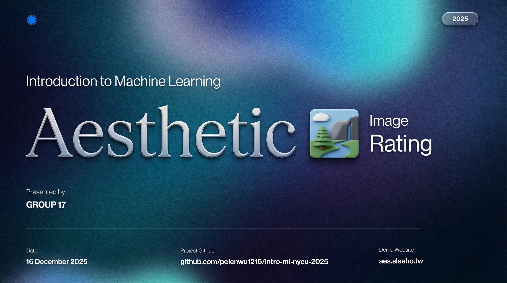
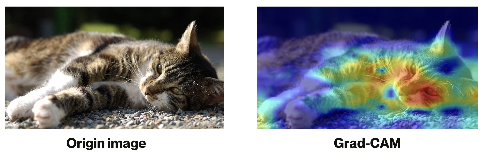

# Composition-Aware Image Aesthetic Assessment with Saliency-Guided Feature Modulation

[](./Final_Report.pdf)

> **Official implementation** for the paper: "Composition-Aware Image Aesthetic Assessment with Saliency-Guided Feature Modulation: Beyond the Eye of the Beholder".
> 
> **Authors**: You-Kang Zhou, An Hsu, Pei-En Wu, Shu-Wei Hsu, Jia-Qi Liu  
> **Institution**: National Yang Ming Chiao Tung University (NYCU), Group 17
>
> **Course**: Introduction to Machine Learning(2025)
> **Instructor**: Berrie Chen

---
## 🎥 Presentation Video

[](https://www.youtube.com/watch?v=WSACYn0GRmE)

> Click the image above to watch the demo on YouTube.

## 🚀 Introduction

**Abstract:** Image Aesthetic Assessment (IAA) is a challenging task due to the subjectivity of human perception and the complex interplay between photographic composition and semantic content. In this work, we propose a unified framework that synergizes modern architectures with explicit attention mechanisms.

Our key contributions include:
- **Saliency-Guided Feature Modulation (SGFM):** A module that leverages saliency maps to learn spatial-wise affine transformations, dynamically recalibrating feature representations.
- **GRN-Aware Attention Pooling:** Incorporating Global Response Normalization (GRN) to enforce channel-wise competition and extract discriminative compositional features.
- **Superior Performance:** We achieve a **Spearman Rank Correlation Coefficient (SRCC) of 0.715** on the CADB dataset, outperforming existing state-of-the-art methods.

<div align="center">
  
  <p><em>Figure 1: Overview of our proposed framework utilizing ConvNeXt V2 with SGFM.</em></p>
</div>

---

## 🏆 Model Zoo & Results

Comparison with state-of-the-art methods on the **CADB Dataset**:

| Method | Backbone | SRCC ↑ | Improvement |
| :--- | :--- | :---: | :---: |
| Baseline | ResNet-50 | 0.642 | - |
| Phase 2 | Swin-T | 0.671 | +4.5% |
| Phase 3 | Swin-T (Opt) | 0.692 | +7.8% |
| **Ours (Phase 4)** | **ConvNeXt V2** | **0.715** | **+11.3%** |

> **Note:** Models were trained using `AdamW` optimizer with learning rate `1e-4` and `batch_size=16` (resized to 384x384).

---

## 📄 Project Materials

| Material | Format | Description |
| :--- | :---: | :--- |
| **Final Report** | [](./Final_Report.pdf) | The comprehensive technical report (CVPR format). |
| **Presentation** | [](./docs/Presentation.pdf) | Slides used for the final presentation. |

## 🛠️ Installation

1. **Clone the repository:**
    ```bash
    git clone https://github.com/peienwu1216/SGFM-Aesthetic-Assessment.git
    cd SGFM-Aesthetic-Assessment
    ```

2. **Install dependencies:**
    ```bash
    pip install -r requirements.txt
    ```
    *Dependencies include: `torch`, `torchvision`, `timm`, `flask`, `opencv-python`, etc.*

3. **Dataset Preparation:**
    - Download the **CADB Dataset**.
    - Ensure the directory structure matches the `dataset.py` configuration in each phase folder.

---

## 🧑‍💻 Usage

We provide the implementation code for the four evolutionary phases of our model.

### Training

To train the final SOTA model (Phase 4 - ConvNeXt V2):
```bash
cd phase4_convnext
python train.py --epochs 50 --batch_size 16 --lr 1e-4
```

To reproduce the ablation studies or previous phases:

**Phase 1: Baseline (ResNet + SAMP)**
```bash
cd phase1_baseline
python train.py --epoch 50 --batch_size 32 --lr 1e-4
```

**Phase 2: Swin Transformer**
```bash
cd phase2_swin
python train.py --epochs 50 --batch_size 32 --lr 1e-4
```

**Phase 3: Swin-T Opt**
```bash
cd phase3_swin_opt
python train.py --epochs 50 --batch_size 32 --lr 1e-4
```

### Web Demo
We provide a user-friendly Flask application to visualize the aesthetic scoring and attribute analysis.

```bash
cd app_demo

# 1. Install backend requirements
pip install -r requirements.txt

# 2. Setup Frontend (requires Node.js)
cd frontend
npm install
npm run build
cd ..

# 3. Start the Flask server
python app.py
```
Visit `http://localhost:5000` to try the demo.

---

## 🖼️ Qualitative Analysis

<div align="center">
  
</div>

**Grad-CAM Visualization:**
- **Baseline (ResNet-50):** Often attends to background textures or irrelevant objects.
- **Ours (ConvNeXt V2 + SGFM):** Consistently focuses on the main subject (e.g., the cat) and follows key compositional lines, aligning closely with human visual perception.

---

## 📂 Directory Structure

```
.
├── phase1_baseline/    # ResNet-50 + SAMPNet
├── phase2_swin/        # Swin Transformer + RankLoss
├── phase3_swin_opt/    # Swin-T + Layout Queries
├── phase4_convnext/    # Final Model (ConvNeXt V2 + SGFM + GRN)
├── app_demo/           # Flask Web Application (Backend + Frontend)
├── Final_Report.pdf    # Our Final project report paper
└── requirements.txt
```

---
## 👥 Team

<table align="center">
  <tr>
    <td align="center">
      <a href="https://github.com/slashotw">
        
        <br />
        <sub><b>You-Kang Zhou</b></sub>
      </a>
    </td>
    <td align="center">
      <a href="https://github.com/mikehsuhoodie">
        
        <br />
        <sub><b>An Hsu</b></sub>
      </a>
    </td>
    <td align="center">
      <a href="https://github.com/peienwu1216">
        
        <br />
        <sub><b>Pei-En Wu</b></sub>
      </a>
    </td>
    <td align="center">
      <a href="https://github.com/sophiehsu0213">
        
        <br />
        <sub><b>Shu-Wei Hsu</b></sub>
      </a>
    </td>
    <td align="center">
      <a href="https://github.com/kiki0518">
        
        <br />
        <sub><b>Jia-Qi Liu</b></sub>
      </a>
    </td>
  </tr>
</table>

## Contact
If you have any questions or suggestions, feel free to contact the author via [Email](mailto:peienwu.ee13@nycu.edu.tw).